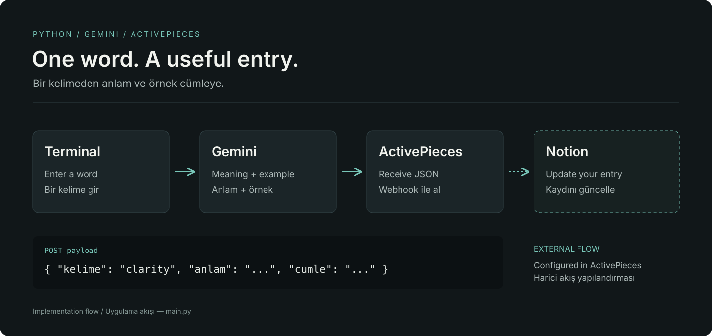

# Notion Dictionary Automation

[English](#english) · [Türkçe](#türkçe)



## English

A Python terminal workflow that asks Gemini for a word’s meaning and an example sentence, then sends the result to an ActivePieces webhook for your Notion integration.

### Features

- Interactive word input in the terminal.
- Gemini JSON response containing a definition and example sentence.
- Webhook payload with `kelime`, `anlam` and `cumle`.
- The Notion update is configured in your external ActivePieces flow.

### Getting started

Install the Python dependencies. Create a local `.env` file with `API_KEY` for Gemini and `WEBHOOK_URL` for your ActivePieces flow, then run `python main.py`.

```bash
git clone https://github.com/talhacaglar/notion-dictionary-automation.git
cd notion-dictionary-automation
python -m venv .venv
source .venv/bin/activate
pip install -r requirements.txt
python main.py
```

Type a word at the prompt. Use `q`, `exit` or `çık` to stop. This script initiates from terminal input; it does not watch a Notion database or call the Notion API directly. The diagram shows that implementation and the external integration boundary.

## Türkçe

Bir kelimenin anlamını ve örnek cümlesini Gemini’den alıp Notion entegrasyonunuz için sonucu ActivePieces webhook’una gönderen Python terminal akışı.

### Özellikler

- Terminalden etkileşimli kelime girişi.
- Anlam ve örnek cümle içeren Gemini JSON yanıtı.
- `kelime`, `anlam` ve `cumle` alanlarını taşıyan webhook verisi.
- Notion güncellemesi, harici ActivePieces akışınızda yapılandırılır.

### Başlangıç

Python bağımlılıklarını kurun. Yerel `.env` dosyasında Gemini için `API_KEY`, ActivePieces akışınız için `WEBHOOK_URL` tanımlayın; ardından `python main.py` çalıştırın.

```bash
git clone https://github.com/talhacaglar/notion-dictionary-automation.git
cd notion-dictionary-automation
python -m venv .venv
source .venv/bin/activate
pip install -r requirements.txt
python main.py
```

İsteme bir kelime yazın. Çıkmak için `q`, `exit` veya `çık` kullanın. Betik terminal girdisiyle başlar; Notion veritabanını izlemez ve Notion API’sini doğrudan çağırmaz. Diyagram bu uygulamayı ve harici entegrasyon sınırını gösterir.
